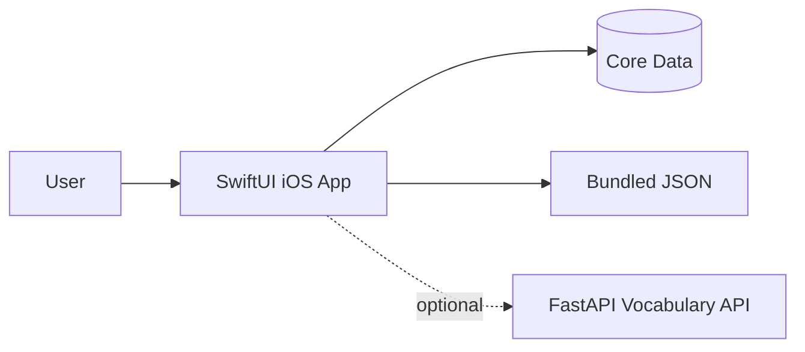
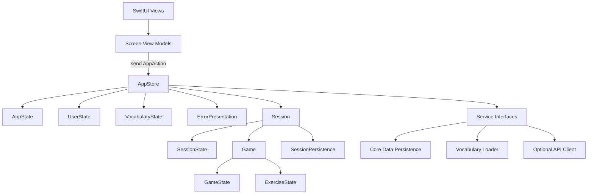

# fastVocab PoC Architecture

Status: Frozen for PoC implementation  
Authority: `docs/requirements/req_poc_final.md` v1.4

## 1. Purpose

This document defines the implementation architecture for the fastVocab PoC. Product behavior remains governed by the authoritative requirement specification. Where that specification is silent, this architecture chooses the smallest explicit solution that satisfies the frozen implementation instructions.

## 2. Architectural Principles

1. `AppStore` is the single source of truth for application state.
2. Every state mutation occurs inside `AppStore.send(_:)` in response to an `AppAction`.
3. `Session` exists only while a lesson is recoverable or while its result is being presented.
4. `Session` owns `SessionState`, `Game`, and `SessionPersistence`.
5. `Game` owns `GameState` and `ExerciseState`.
6. Persistent lesson snapshots represent question boundaries, never transient presentation state.
7. Vocabulary loading uses Cache, then Bundle, then API, then Error.
8. The FastAPI service is optional. Core use cases must work from bundled vocabulary without a network connection.
9. SwiftUI views and view models may derive presentation values and send actions, but may not directly mutate application state.
10. Simplicity takes priority over speculative extensibility.

## 3. System Context



The iOS application owns lesson generation, answer validation, scoring, recovery, and user progress. The backend only supplies vocabulary content. It does not own gameplay or progress.

## 4. Client Architecture



### 4.1 AppStore

`AppStore` is an `@MainActor` observable reference type. It exposes read-only state and one mutation entry point:

```swift
@MainActor
@Observable
final class AppStore {
    private(set) var appState: AppState
    private(set) var userState: UserState
    private(set) var vocabularyState: VocabularyState
    private(set) var session: Session?
    private(set) var errorPresentation: ErrorPresentation?

    func send(_ action: AppAction) {
        // Validate transition, mutate state, and start required effects.
    }
}
```

The concrete implementation may split action handling into private extensions for readability. It must not expose additional mutation APIs.

### 4.2 Actions and Effects

`AppAction` describes user events, lifecycle events, and service results. Representative actions include:

```text
appLaunched
initializationCompleted
initializationFailed
startLessonRequested
topicSelected
answerSubmitted
continueRequested
pauseRequested
resumeRequested
cancelRequested
persistenceCompleted
persistenceFailed
scoreDismissed
```

Services do not mutate state. When `send(_:)` starts asynchronous work, the result returns to the store as another action. This keeps all observable changes serialized on the main actor and testable through action sequences.

### 4.3 State Ownership

```text
AppStore
|- AppState
|- UserState
|- VocabularyState
|- ErrorPresentation?
`- Session?
   |- SessionState
   |- Game
   |  |- GameState
   |  `- ExerciseState
   `- SessionPersistence
```

`AppState` controls navigation among exactly five pages: Splash, Home, Topic Selection, Game, and Score. Errors are presentations over the current page, not a sixth page.

`SessionState` controls lesson lifecycle. `GameState` controls the current question lifecycle. `ExerciseState` contains the current exercise and answer data. These responsibilities remain separate even though all changes are coordinated by `AppStore`.

### 4.4 MVVM Boundary

Each page has a small view model that:

* reads the store's published state,
* derives display-only values,
* translates view events into `AppAction` values.

View models hold no duplicate business state and perform no scoring, answer validation, persistence, or navigation decisions. This preserves MVVM without creating a second source of truth.

## 5. Services

Services are injected into `AppStore` through a dependency container so tests can use deterministic in-memory implementations.

### 5.1 VocabularyLoader

The loader attempts sources in this exact order:

1. valid Core Data cache,
2. valid bundled JSON,
3. optional FastAPI request,
4. unavailable state with an error presentation.

A source is usable only when it decodes successfully and contains at least one topic capable of creating a lesson with three or more vocabulary items. API failure is ignored whenever an earlier source supplied usable data.

### 5.2 SessionRepository

Stores, loads, and deletes one recoverable lesson snapshot. The initial lesson is saved at its first question boundary. Later saves occur after a question is fully resolved and the game has advanced to the next question boundary, when pausing from a boundary, or when backgrounding while presenting a question. Backgrounding during transient feedback retains the previously saved boundary. Cancellation deletes the snapshot. Completion and game over delete recoverable state after durable result and progress updates succeed.

### 5.3 UserProgressRepository

Loads and saves accumulated XP, lesson statistics, and per-vocabulary statistics in Core Data. Updates are committed from resolved questions so restored sessions do not count an answer twice.

### 5.4 VocabularyCacheRepository

Stores validated vocabulary received from the API. Bundled content is read directly from the application bundle and does not need to be copied merely to satisfy the cache layer.

## 6. Persistence Architecture

Core Data is the required persistence technology. Managed object types are internal storage records; business logic uses plain Swift domain models. Mapping is explicit at the repository boundary.

Persistent categories are:

* one recoverable lesson snapshot,
* accumulated user progress,
* lesson result history,
* per-vocabulary learning statistics,
* optional cached vocabulary payload and metadata.

The current generated SwiftData `Item` scaffold is not part of the product architecture and will be replaced during implementation.

## 7. Recovery Contract

A saved question index always identifies the next unresolved question to present.

```text
submit answer
-> validate and update statistics
-> advance to the next question or phase
-> persist snapshot
-> present the next question
```

Selections, feedback banners, text-field contents, and animations are not persisted. On restoration, the store reconstructs the game at the saved question boundary with the saved lesson phase, question order, review queue, hearts, statistics, and unique mistakes.

## 8. Backend Architecture

The optional FastAPI application exposes only:

* `GET /health`
* `GET /v1/topics`
* `GET /v1/topics/{topic_id}/vocabulary`

Responses use the same logical vocabulary schema as bundled JSON. The backend has no authentication, user data, progress synchronization, gameplay logic, or required startup role.

## 9. Error Handling

Errors are converted to small domain error values and surfaced through `ErrorPresentation` when user action is required.

* No usable vocabulary: remain on Splash, explain the failure, and allow retry.
* Optional API failure after usable local data: continue without interruption.
* Corrupt recoverable lesson: remove only the invalid snapshot, retain user progress, and return Home.
* Persistence failure: retain in-memory state, present a retryable error, and do not claim that the operation was durably saved.

## 10. Concurrency

`AppStore` runs on the main actor. Vocabulary loading, network requests, and Core Data repository operations use async functions. Results cross back into the store through actions. A lesson-start action is ignored while another active session exists, enforcing the single-active-lesson constraint.

## 11. Test Boundaries

* Store tests send actions and assert state transitions and emitted service calls.
* Domain tests validate exercise answers, scoring, hearts, review deduplication, and phase transitions.
* Repository tests use an in-memory Core Data store.
* Vocabulary loader tests control each source and verify priority and fallback.
* UI tests launch with deterministic bundled/test data and exercise the primary lesson flow.

## 12. Explicit Non-Goals

This architecture provides no authentication, social graph, leaderboard, monetization, cloud synchronization, AI content, adaptive learning, spaced repetition, achievements, notifications, analytics, subscriptions, or multiplayer support. No extension point for those features is required in the PoC.