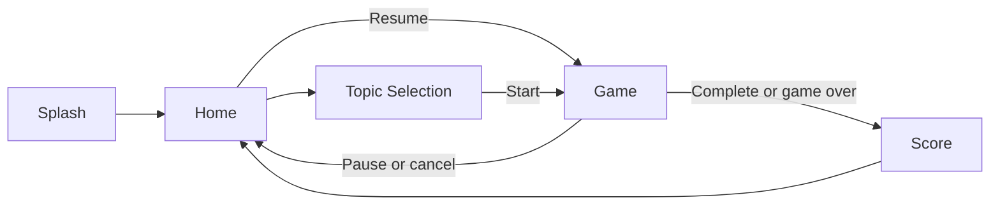

# fastVocab PoC Design

Status: Frozen for PoC implementation  
Authority: `docs/requirements/req_poc_final.md` v1.4

## 1. Design Goal

The PoC provides a small offline-first lesson experience that is understandable without onboarding. It supports exactly five pages and three exercise types. UI details may evolve during implementation, but the behavior in this document is frozen.

## 2. Navigation and Pages



Errors are alerts or inline presentations on one of these pages. They do not create an additional page.

### 2.1 Splash Page

Displays the product name and loading state while the application:

1. loads user progress,
2. loads a recoverable session if one exists,
3. resolves vocabulary through Cache, Bundle, API, Error,
4. validates that at least one topic can create a lesson.

On success, Splash automatically transitions to Home. If no usable vocabulary exists, Splash shows an error and Retry action and does not allow lesson creation. Retry reruns the complete initialization sequence so user progress, recoverable session, and vocabulary results are coordinated consistently.

### 2.2 Home Page

Displays accumulated XP and a clear action to choose a topic. When a recoverable paused or interrupted lesson exists, Home also displays its topic and progress with a Resume action. Starting another lesson is unavailable while a recoverable lesson exists; the user must resume and finish or cancel it.

### 2.3 Topic Selection Page

Displays each valid topic with its name and vocabulary count. Selecting a topic creates a lesson from that topic and navigates to Game. Topics with fewer than three valid items are not eligible to start and are excluded from the usable topic list.

### 2.4 Game Page

The Game page displays:

* phase label for Main or Review,
* progress through the current phase,
* hearts during Main only,
* exercise prompt and answer controls,
* answer feedback after submission,
* Pause and Cancel actions.

Pause is available while a question is being presented, saves that current boundary, and returns Home. It is unavailable while answer feedback is shown. Cancel asks for confirmation, deletes active lesson progress, and returns Home. Temporary input is reset after pause, interruption, or recovery.

### 2.5 Score Page

Displays:

* completion status: completed or game over,
* XP earned in the main phase,
* correct and wrong answer counts,
* unique vocabulary mistakes with the expected answer for each mistaken exercise,
* a Home action.

The Score page is also used after game over. A review round is never entered after game over.

## 3. Domain Model

### 3.1 Vocabulary

```swift
struct VocabularyTopic: Identifiable, Codable, Equatable {
    let id: String
    let name: String
    let sourceLanguageCode: String
    let targetLanguageCode: String
    let items: [VocabularyItem]
}

struct VocabularyItem: Identifiable, Codable, Equatable {
    let id: String
    let word: String
    let article: String
    let plural: String
    let translations: [String]
}
```

Identifiers are stable strings supplied by content. A valid item has non-empty values for all fields and at least one translation.

### 3.2 Lesson

```swift
enum SessionPhase: String, Codable {
    case main
    case review
}

enum ExerciseType: String, Codable {
    case article
    case plural
    case translation
}

struct LessonQuestion: Identifiable, Codable, Equatable {
    let id: String
    let vocabularyID: String
    let exerciseType: ExerciseType
}
```

A new lesson contains every valid vocabulary item in the selected topic once in its main question list. Question order is fixed when the lesson is created and persisted for recovery.

Exercise types are assigned by cycling through article, plural, and translation across the question list. Since a valid lesson has at least three items, every supported exercise type is present. This deterministic rule is simple, testable, and guarantees requirement coverage without adaptive behavior.

Review questions preserve the exercise type used for that vocabulary item in the main phase. The review queue follows first-mistake order.

### 3.3 Statistics

```swift
struct LessonStatistics: Codable, Equatable {
    var mainCorrect: Int
    var mainWrong: Int
    var reviewCorrect: Int
    var reviewWrong: Int
    var earnedXP: Int
    var mistakeVocabularyIDs: [String]
}
```

`mistakeVocabularyIDs` contains unique identifiers. Wrong counts record every incorrect occurrence, including another incorrect answer during review. Per-vocabulary progress records main and review attempts, correct answers, and wrong answers.

## 4. Exercise Design

### 4.1 Article

The prompt displays a vocabulary word and asks for its article. The available article choices are the unique articles present in the selected topic, with the correct article included. Bundled German content therefore presents `der`, `die`, and `das`.

### 4.2 Plural

The prompt displays the singular word and asks for the plural. The user enters text.

### 4.3 Translation

The prompt displays the vocabulary word with its article and asks for a translation. The user enters text. Any translation listed for the item is accepted.

### 4.4 Answer Normalization

Before comparison, text answers are trimmed, compared case-insensitively, and normalized using Unicode canonical equivalence. No fuzzy matching, typo correction, or AI validation is used. Article choices compare their normalized value with the item's article.

### 4.5 Feedback

Each submitted answer produces correct or incorrect feedback and reveals the expected answer when incorrect. A resolved answer cannot be submitted twice. Continue advances to the next boundary. On the third incorrect main answer, game over is recorded immediately and Score is shown without entering review.

## 5. Lesson Rules

### 5.1 Main Phase

* Starts with three hearts.
* Presents every main question once.
* Correct answer: increment main correct and award 10 XP.
* Incorrect answer: increment main wrong, consume one heart, and add the vocabulary ID to the review queue only if absent.
* Reaching zero hearts ends the lesson immediately as game over.

### 5.2 Review Phase

After all main questions, an empty review queue completes the lesson immediately. Otherwise:

* each queued vocabulary item is presented once,
* correct answers increment review correct and award no XP,
* incorrect answers increment review wrong and award no XP,
* hearts are hidden and unchanged,
* no item is requeued.

After the final review question, the lesson completes.

### 5.3 Progress Commit

Lesson XP and vocabulary statistics are staged inside the session while it is active. They are merged into persistent user progress only when the lesson completes or reaches game over. Cancellation deletes the session and its staged changes. The terminal merge, lesson result save, and recoverable snapshot deletion occur in one Core Data transaction to avoid duplicate progress after a crash.

## 6. Persistence Design

A recoverable snapshot contains:

* session and topic identifiers,
* session lifecycle and phase,
* ordered main questions,
* ordered review queue without duplicates,
* next question index in the current phase,
* remaining hearts,
* staged lesson statistics,
* unique mistake identifiers,
* creation and update timestamps.

The snapshot never contains selected answers, typed text, feedback visibility, animation state, or other transient UI state.

## 7. Vocabulary JSON

Bundled and API vocabulary use a versioned envelope:

```json
{
  "schemaVersion": 1,
  "topics": [
    {
      "id": "household-a1",
      "name": "Household",
      "sourceLanguageCode": "de",
      "targetLanguageCode": "en",
      "items": [
        {
          "id": "de-household-table",
          "word": "Tisch",
          "article": "der",
          "plural": "Tische",
          "translations": ["table"]
        }
      ]
    }
  ]
}
```

Malformed payloads are rejected as a source. Individual malformed topics do not become selectable.

## 8. Accessibility and Adaptation

The interface uses semantic controls, Dynamic Type, VoiceOver labels, sufficient contrast, and does not communicate correctness by color alone. Layouts use scrolling and adaptive spacing so all controls remain reachable on supported iPhone and iPad sizes and orientations in light and dark appearances.

## 9. Backend Design

FastAPI reads curated JSON and returns the versioned vocabulary schema. The health endpoint reports process availability. No iOS flow waits for the backend when cache or bundle data is usable.
