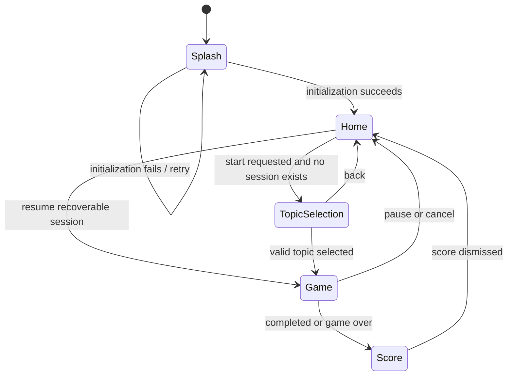
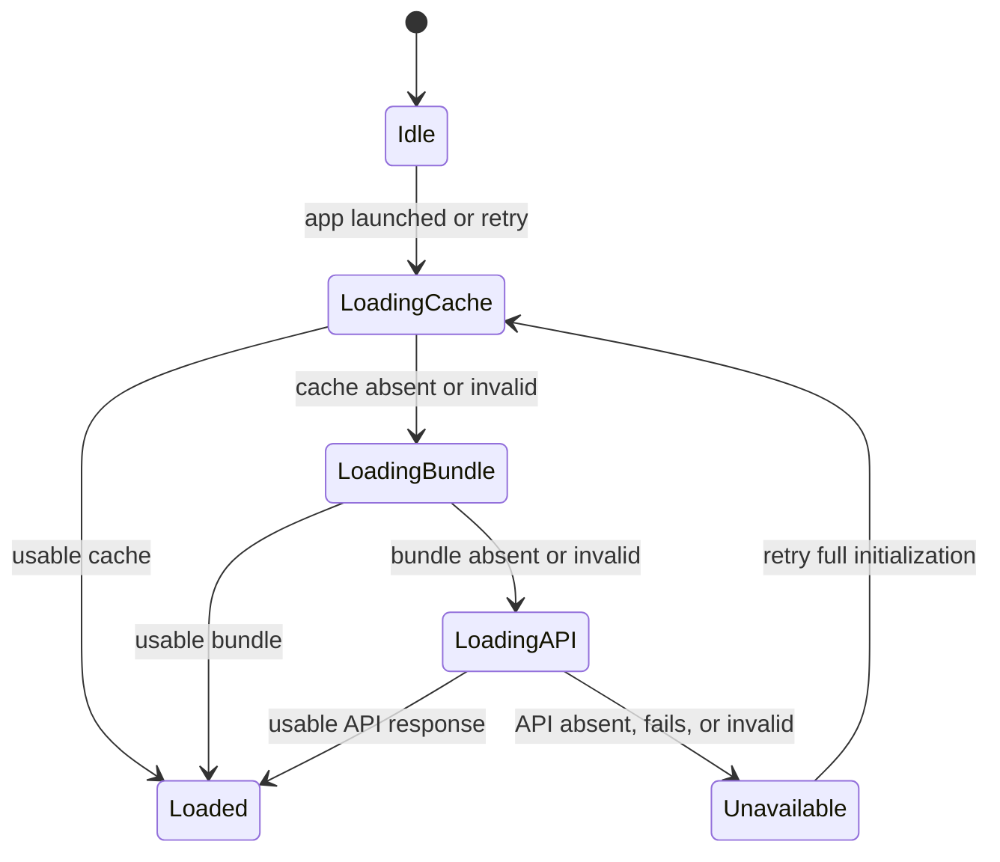
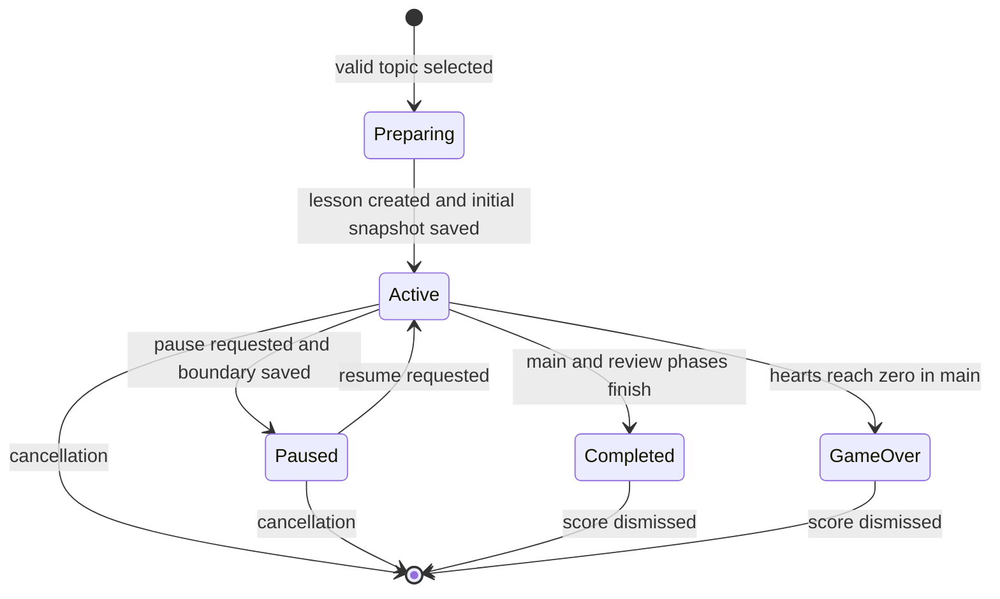
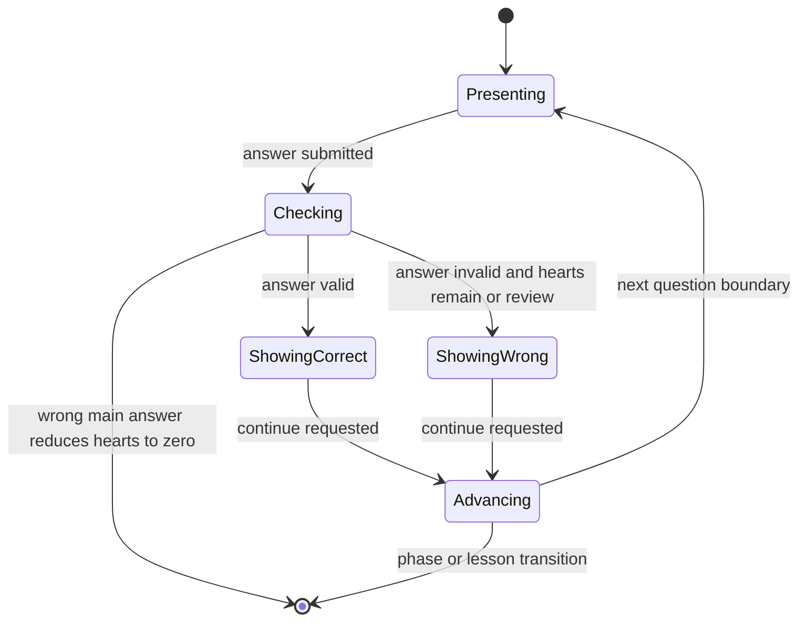
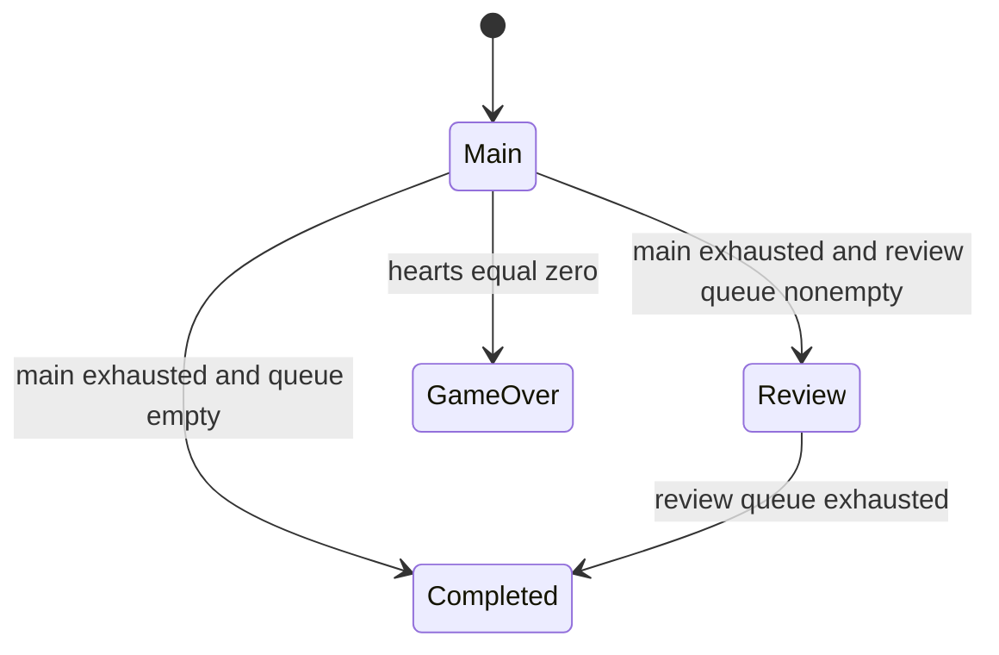

# fastVocab PoC State Model

Status: Frozen for PoC implementation  
Authority: `docs/requirements/req_poc_final.md` v1.4

## 1. Mutation Contract

All transitions begin with `AppStore.send(AppAction)`. State properties are read-only outside the store. Invalid actions are ignored or converted to an error presentation; they never create a partially valid state.

## 2. State Ownership

```text
AppStore
|- appState: AppState
|- userState: UserState
|- vocabularyState: VocabularyState
|- errorPresentation: ErrorPresentation?
`- session: Session?
   |- state: SessionState
   |- game: Game
   |  |- state: GameState
   |  `- exercise: ExerciseState
   `- persistence: SessionPersistence
```

## 3. Application Navigation

```swift
enum AppState: Equatable {
    case splash
    case home
    case topicSelection
    case game
    case score
}
```



Navigation invariants:

* `.game` requires a non-terminal session.
* `.score` requires a completed or game-over session result.
* `.topicSelection` cannot create a lesson while a recoverable session exists.
* Error presentation does not change the page unless a defined recovery transition requires it.

## 4. Vocabulary State

```swift
enum VocabularyState: Equatable {
    case idle
    case loading(source: VocabularySource)
    case loaded(topics: [VocabularyTopic], source: VocabularySource)
    case unavailable
}

enum VocabularySource: String, Equatable {
    case cache
    case bundle
    case api
}
```



`Loaded` requires at least one topic with three valid items. Backend failure has no state effect after an earlier source loads successfully. Retry restarts user progress, recoverable session, and vocabulary loading; Home is entered only after those initialization results are reconciled.

## 5. Session State

```swift
enum SessionState: String, Codable, Equatable {
    case preparing
    case active
    case paused
    case completed
    case gameOver
}
```



Interruption recovery reconstructs a saved `.active` or `.paused` session at its stored question boundary. It does not require a separate durable recovering state; loading is represented by application initialization.

## 6. Game State

```swift
enum GameState: String, Codable, Equatable {
    case presenting
    case checking
    case showingCorrect
    case showingWrong
    case advancing
}
```

`checking`, `showingCorrect`, `showingWrong`, and `advancing` are transient and are never persisted. Restored games always enter `presenting`.



Only one submission is accepted while a game is outside `presenting`.

Pause is accepted only from `presenting`. `appMovedToBackground` saves when the game is `presenting`; from transient game states it performs no save and leaves the previously durable question boundary unchanged.

## 7. Exercise State

```swift
enum ExerciseState: Codable, Equatable {
    case article(ArticleExercise)
    case plural(TextExercise)
    case translation(TextExercise)
}
```

`ExerciseState` contains the current question and expected answer data. User selection and typed input remain local view state until `answerSubmitted` is sent.

## 8. Session Phase and Review Queue



Review queue invariants:

* IDs are unique.
* Insertion order is the order of first incorrect main answers.
* Review mistakes update statistics but never alter the queue.
* Review never changes hearts and never transitions to game over.

## 9. Answer Transition Table

| Phase | Result | Statistics | XP | Hearts | Queue | Next terminal state |
| --- | --- | --- | --- | --- | --- | --- |
| Main | Correct | `mainCorrect + 1` | `+10` | unchanged | unchanged | None |
| Main | Wrong, hearts remain | `mainWrong + 1` | `+0` | `-1` | add if absent | None |
| Main | Wrong, zero hearts | `mainWrong + 1` | `+0` | `0` | add if absent | Game over |
| Review | Correct | `reviewCorrect + 1` | `+0` | unchanged | unchanged | None |
| Review | Wrong | `reviewWrong + 1` | `+0` | unchanged | unchanged | None |

## 10. Persistence Boundary

The durable index always points to the next unresolved question.

1. Accept one answer while presenting.
2. Validate and update in-memory session statistics.
3. Show feedback, except when game over terminates immediately.
4. On Continue, move to advancing.
5. Update phase and next index.
6. Save the boundary snapshot.
7. Construct the next exercise and return to presenting.

For a terminal transition, step 6 atomically commits the lesson result and user progress and removes the recoverable snapshot.

## 11. Core Actions

```swift
enum AppAction {
    case appLaunched
    case retryInitialization
    case startLessonRequested
    case topicSelected(id: String)
    case answerSubmitted(String)
    case continueRequested
    case pauseRequested
    case resumeRequested
    case cancelRequested
    case cancelConfirmed
    case scoreDismissed
    case appMovedToBackground // Saves only while presenting a question.
    case vocabularyLoaded(Result<VocabularyCatalog, AppError>)
    case sessionLoaded(Result<SessionPersistence?, AppError>)
    case userProgressLoaded(Result<UserProgress, AppError>)
    case persistenceCompleted(PersistenceOperation)
    case persistenceFailed(AppError)
}
```

Concrete associated values may be refined during implementation without changing the transitions defined here.

## 12. Error Presentation

```swift
struct ErrorPresentation: Identifiable, Equatable {
    let id: UUID
    let kind: AppError
    let recovery: ErrorRecovery?
}
```

Error presentation is orthogonal to navigation. The only blocking initialization error is unavailable vocabulary. Network failure is not presented when local vocabulary is usable.
