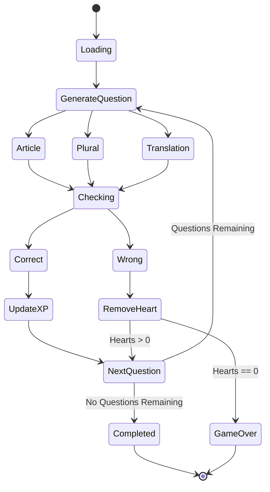
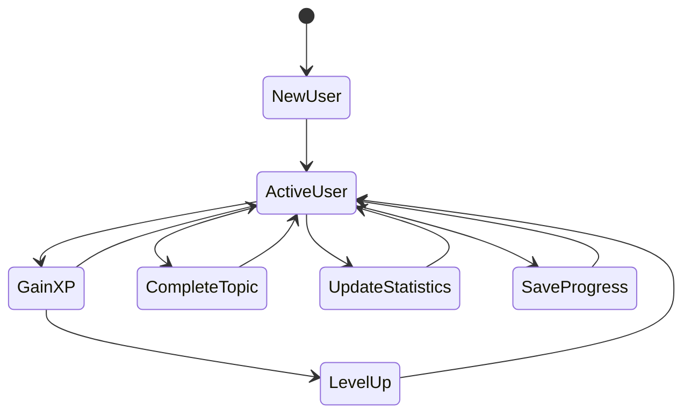
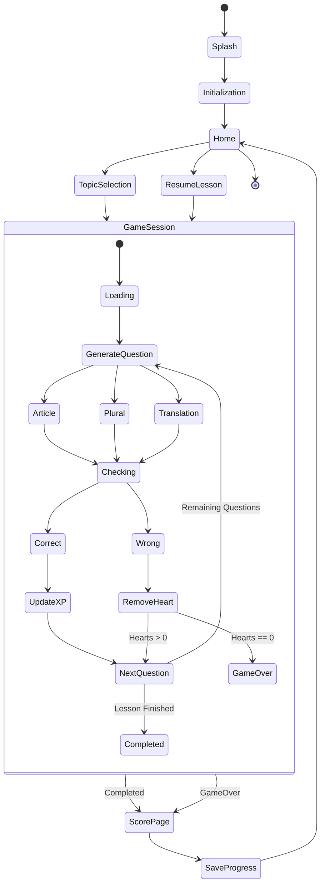

I think we're still missing one state. If we want this to evolve into Duolingo-like behaviour later, I would separate the navigation state from the game state. The Game Page itself is actually a state machine.

The complete PoC would look like this:

```text
Application State Machine

                    APP START
                        |
                        |
                     Splash
                        |
                 Initialization
                        |
                 Load User State
                        |
                 Load Vocabulary
                        |
                   Success?
                    /    \
                  No      Yes
                  |        |
                Error     Home
                           |
                      Select Topic
                           |
                         Topic
                           |
                     Press START
                           |
                    Create Session
                           |
                          Game
                           |
                     Finish Lesson?
                     /           \
                   No             Yes
                   |               |
               Continue           Score
                   |               |
                   |            Update XP
                   |            Save Progress
                   |               |
                   -----------------
                           |
                         Home
```

The Game Page itself should have its own state machine.



The User State should also be independent.



For the whole application, I would model it as follows:



### Proposed Models

| State Machine   | Responsibility                 |
| --------------- | ------------------------------ |
| AppState        | Navigation between pages       |
| GameState       | Lesson lifecycle               |
| UserState       | XP, level and statistics       |
| SessionState    | Current lesson progress        |
| ExerciseState   | Current question state         |
| VocabularyState | Vocabulary loading and caching |

I would add one more state that wasn't present in the previous document:

```swift
enum SessionState{

    case preparing
    case active
    case paused
    case completed
    case gameOver
    case saving
}
```

This might look unnecessary for the PoC, but it solves two future problems immediately:

* Resume unfinished lessons.
* Synchronization with cloud storage later.
* Daily challenges.
* Multiplayer challenges.
* Session recovery after application termination.

So my recommendation is to have **five independent state machines** instead of one giant one:

1. AppState (navigation).
2. GameState (exercise flow).
3. SessionState (lesson lifecycle).
4. UserState (user progression).
5. VocabularyState (content loading and caching).

Keeping them independent will make the SwiftUI implementation considerably cleaner and aligns well with MVVM and future feature additions without requiring the entire state model to be redesigned.
