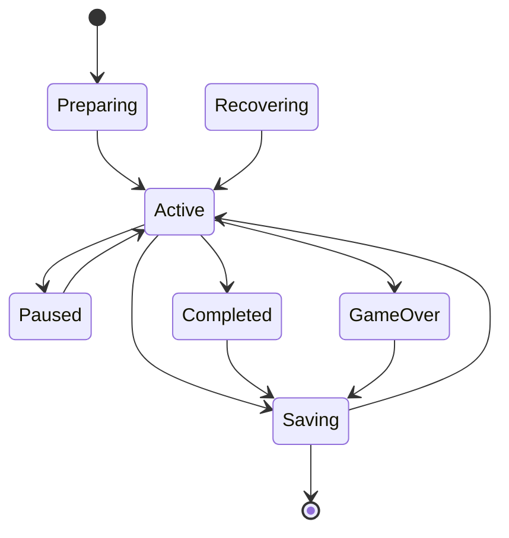
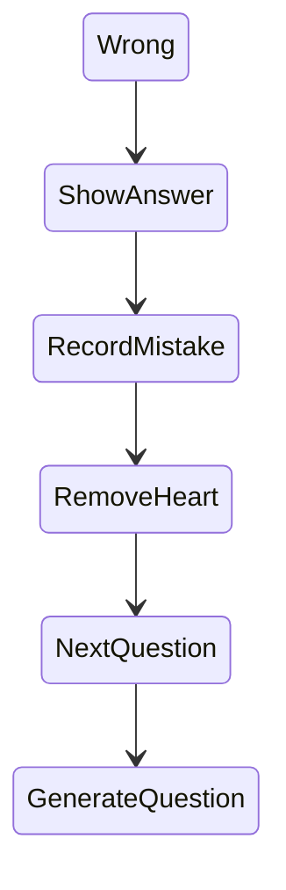
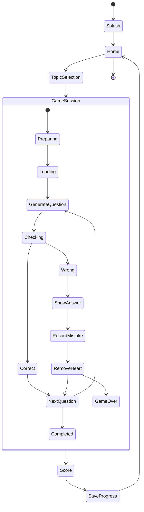

I agree with almost all of the feedback. There are only two things I would change from its proposal.

1. I would not put `error(AppError)` inside `AppState`. I prefer an independent `ErrorState` since every module can fail.
2. I don't like `GameState` and `ExerciseState` being merged. They solve different problems.

I would slightly redesign it as follows.

## Final State Architecture

```text
                AppState
                    |
                    |
      -----------------------------------
      |              |                  |
   Splash           Home               Score
                     |
               TopicSelection
                     |
                GameSession
                     |
               SessionState
                     |
             -------------------
             |                 |
         GameState         PauseState
             |
        ExerciseState
             |
      ----------------------
      |         |            |
    Article   Plural     Translation


                    |
                UserState
                    |
                 XP
               Level
              Statistics
               Progress


                    |
             VocabularyState
                    |
            Loading / Loaded
            Cached / Failed


                    |
               ErrorState
                    |
             Retry / Recover
```

So we now have **7 independent models**.

| State           | Responsibility     |
| --------------- | ------------------ |
| AppState        | Navigation         |
| SessionState    | Lesson lifecycle   |
| GameState       | Question lifecycle |
| ExerciseState   | Current exercise   |
| UserState       | User progression   |
| VocabularyState | Content management |
| ErrorState      | Error handling     |

I think this separation is cleaner for SwiftUI.

---

## Updated AppState

```swift
enum AppState{

    case splash

    case home

    case topicSelection

    case gameSession

    case score

}
```

Notice there is no error state.

Errors belong to:

```swift
enum ErrorState{

    case none

    case initializationFailed

    case vocabularyFailed

    case corruptedSession

    case savingFailed

    case networkUnavailable

    case unknown

}
```

because multiple modules can fail independently.

For example:

```text
Initialization Failed

        |
     Retry
        |
    Success?
     /    \
   No      Yes
   |        |
 Error     Home


---------------------


Vocabulary API Failed

       |
 Cached Exists?
      /  \
    Yes   No
    |      |
 Continue  Error
    |
   Home


---------------------


Saving Failed

      |
    Retry
      |
    Success?
     /    \
   No      Yes
   |        |
 Warning   Continue
```

---

## Session State

This is where I disagree the most with the previous document. Session recovery deserves its own state machine.

```swift
enum SessionState{

    case preparing

    case active

    case paused

    case saving

    case completed

    case gameOver

    case recovering

}
```

Transitions:



This immediately gives us:

* pause support
* recovery support
* quit support
* cloud sync support later
* daily challenge support later

---

## Updated Game State

```swift
enum GameState{

    case loading

    case generatingQuestion

    case checking

    case correct

    case wrong

    case nextQuestion

}
```

Notice that:

```swift
.article

.plural

.translation
```

have been removed.

They are NOT game states.

They are exercise states.

This separation is much cleaner.

---

## Exercise State

```swift
enum ExerciseState{

    case article

    case plural

    case translation

}
```

Example:

```text
Game State

loading

↓

generateQuestion

↓

Exercise State

plural

↓

checking

↓

wrong

↓

removeHeart

↓

nextQuestion

↓

generateQuestion

↓

article

↓

checking

↓

correct

↓

nextQuestion
```

---

## Persistence Rules

I would explicitly define them.

| Event                 | Save? |
| --------------------- | ----- |
| Question answered     | YES   |
| Pause lesson          | YES   |
| Quit lesson           | YES   |
| Finish lesson         | YES   |
| Game over             | YES   |
| XP updated            | YES   |
| App backgrounded      | YES   |
| Vocabulary downloaded | YES   |

Everything important gets persisted.

This gives us proper session recovery.

---

## Wrong Answer Flow

This was indeed missing.



Rules:

```text
Wrong answer

↓

show correct answer

↓

record mistake

↓

lose one heart

↓

0 XP

↓

next question

↓

mistakes appear in score page
```

No XP is awarded.

---

## Question Generation Rules

```text
Mixed Mode

50%
Article

30%
Plural

20%
Translation


------------------


Question already wrong?

        |
       YES
        |
 increase probability
        |
     Article
      50%
        |
      75%


------------------


Future Feature

Spaced repetition

↓

adaptive weighting

↓

AI assisted weighting
```

The engine remains extensible without AI.

---

## Offline Rules

```text
Application Starts

        |
   Load Cache
        |
     Success?
      /   \
    YES   NO
    |      |
   Home   API Call
            |
         Success?
          /  \
        YES   NO
        |      |
      Cache    Error
      Home
```

Priority order:

```text
1. Cached vocabulary
2. Bundled vocabulary
3. FastAPI
4. Error page
```

This guarantees offline support.

---

## Final Navigation Model



## Recommendation

I would incorporate about 95% of the other AI's feedback, but I would finalize the architecture with **7 independent state models instead of 5 or 6**:

1. `AppState`
2. `SessionState`
3. `GameState`
4. `ExerciseState`
5. `UserState`
6. `VocabularyState`
7. `ErrorState`

The most important change is treating `GameState` and `ExerciseState` as separate concerns. `GameState` describes *where the lesson is in its lifecycle* (loading, checking, next question, etc.), whereas `ExerciseState` describes *what kind of question is currently being presented* (article, plural, translation). Keeping them orthogonal avoids an explosion of combined states such as `checkingArticle`, `checkingPlural`, `correctArticle`, and so on.

Combined with explicit persistence rules, offline behaviour, and error handling, this provides a sufficiently complete and implementation-oriented state model for an autonomous AI or developer to build the PoC without making significant product-level assumptions.
